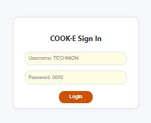

<p align="center">
  
</p>

# COOK·E – Cognitive Organized Online Kitchen Expert

COOK·E is an **autonomous, multi-agent AI system** that transforms a user's free-text cooking request into an optimized, ready-to-order grocery cart from real supermarkets. The project demonstrates the power of LLM-based reasoning, product/recipe data integration, and step-by-step pipeline orchestration, all wrapped in a user-friendly web interface.

<p align="center">
  <a href="https://youtu.be/RX-9xe3PETI">
    
  </a>
</p>
<p align="center">
  <em>👆 Click to watch the demo video</em>
</p>

## 🔄 Changes from Original Proposal

During development, we made several architectural adjustments to improve efficiency, reduce redundancy, and better fit our web app structure:  

1. **Recipe Validation Agent → Merged into Recipe Retriever Agent**  
   - **Reason:** The Recipe Retriever already had access to all necessary context and constraints when choosing a recipe. This meant it could also decide whether the recipe was valid, eliminating the need for a separate validator agent.  
   - **Benefit:** Reduced redundant LLM calls and simplified the pipeline logic.  

2. **Changed Order of Inventory Matching and Inventory Confirmation**  
   - **Original Plan:** Filter the recipe’s ingredients against the user’s inventory before asking for confirmation.  
   - **Updated Approach:** First match the recipe’s ingredients against the **entire** inventory to ensure correct ingredient mapping, then show this matched list to the user for confirmation.  
   - **Reason:** Our web interface already organizes ingredients neatly in the confirmation table, and the reasoning step in the confirmation agent was sufficient to handle filtering. No additional inventory filtering step was required afterward.  

3. **Delivery Validator Agent → Merged into Market Selector Agent**  
   - **Reason:** The Market Selector already reasons about store choice, delivery options, and constraints. Incorporating delivery validation directly here allowed it to provide suggestions in one step, based on a unified reasoning process.  

4. **Payment Confirmation & Order Execution Agents → Merged into a Single Agent**  
   - **Reason:** Given our web app structure, it was enough to obtain the user’s confirmation once and then simulate payment and generate the PDF order in a single agent.  
   - **Benefit:** Reduced complexity while still providing clear confirmation and output to the user.  

---

## 🗂️ Project Structure
* **Recipes Database:** Stored as embeddings in a Qdrant vector database and retrieved using a Retrieval-Augmented Generation (RAG) approach for accurate and context-aware recipe matching.


```
COOK-E_Agent/
│
├── agents/                                  # All AI agents, each responsible for a pipeline step
│   ├── _1_llm_context_parser.py              # Parses user free-text into structured JSON (dish, servings, budget, etc.)
│   ├── _2_recipe_retriever.py                # Retrieves or generates the best-matching recipe and validates it
│   ├── _3_recipe_parser.py                    # Converts recipe text into structured ingredient list with quantities
│   ├── _4_Inventory_Matcher.py                # Matches recipe ingredients to the user's home inventory
│   ├── _5_inventory_confirmation.py           # Creates confirmation table for user to approve required purchases
│   ├── _6_product_matcher.py                   # Maps ingredients to real supermarket products
│   ├── _7_market_selector.py                   # Selects best store(s) based on price, availability, delivery, promotions
│   ├── _8_order_execution.py                   # Simulates payment, generates PDF receipts
│
├── data/                                      # Datasets and stored CSVs for inventory, products, and supermarkets
│   ├── home_inventory.csv                      # Current user home inventory
│   ├── old_requests.csv                        # History of user cooking requests, recipes, receipts
│   ├── productsDB.csv                          # Full list of available products from supermarkets
│   ├── supermarketsDB.csv                      # List of supermarkets with metadata
│   ├── unit_productsDB.csv                     # Mapping of product units for matching/normalization
│   └── units.txt                               # Available measurement units for quantities
│
├── examples/                                  # Evaluation examples for the project
│   ├── media/                               # Media files for examples
│   ├── explaining-the-functionality-to-users.md  # File that shows the explination massage to the user and more things in the  web interface  
│   └── 0$-.md                                 # Example markdown file ($ = example number) containing input prompts, outputs, and explanations
│
├── static/                                    # Static files served by Flask
│   ├── fonts/                                  # Fonts used in web UI and PDFs
│   ├── receipts/                               # Generated PDF receipts from orders
│   └── style.css                               # Main CSS file for styling the web interface
│
├── templates/                                 # HTML templates for rendering the web pages
│   ├── login.html                              # Login page template
│   └── main.html                               # Main application interface template
│
├── tokens/                                    # Tracks LLM token usage
│   ├── total_tokens_embed.txt                 # Log file of total tokens consumed by embedding
│   ├── tokens_count.py                         # Utility to update token usage logs
│   └── total_tokens.txt                        # Log file of total tokens consumed
│
├── .env                                       # Environment variables (API keys)
├── .gitignore                                 # Git ignore file to exclude sensitive/unnecessary files
├── app.py                                     # Flask app – handles routes, user sessions, renders HTML
├── pipeline.py                                # Orchestrates execution flow between agents
├── README.md                                  # Project documentation
└── requirements.txt                           # Python dependencies
```

---

## 🌐 Using the COOK·E Web App  

The COOK·E web interface allows you to interact with the autonomous cooking assistant easily.  
Follow these steps to get started:  

### 1️⃣ Start the Server  
Make sure you have installed all dependencies:  
```bash
pip install -r requirements.txt
```
Then run:  
```bash
python app.py
```
The server will start locally, usually at:(the link will be in the terminal output .e.g Running on http://127.0.0.1:5000) 

[http://localhost:5000](http://localhost:5000)  

---

### 2️⃣ Login  
On the login screen, enter the default credentials:  
- **Username:** `TECHNION`  
- **Password:** `0000`  

  

---
### There you will see brief description of the COOK·E system.
### 3️⃣ Create a Cooking Request  
Type your request in natural language. You can include:  
- 🍽 **Dish name** (mandatory)  
- 👥 **Number of servings**  
- 💰 **Budget**  
- 🚚 **Delivery / Pickup** preference  
- 🍃 **Special requests** (e.g., vegan, gluten-free, halal)  

Example:  
```
Vegan shakshuka for 4 people, under 50 NIS, delivery
``` 

---

### 4️⃣ Confirm Ingredients  
COOK·E will check your home inventory and show you a confirmation table of missing items.  
You can:  
- Adjust quantities to buy  
- Change units  
- Remove ingredients you don’t want to purchase by putting `0` in the quantity field

 

---

### 5️⃣ Review and Pay Confirmation
You’ll see:  
- 🛒 **Stores and products** chosen for you  
- 📦 **Delivery options** per store  
- 💰 **Total price**  

You can:  
- Remove items to lower cost  
- Turn off delivery for pickup  
 

! 

---

### 6️⃣ Final Order & Recipe Directions  
After confirming, COOK·E will:  
- Simulate payment  
- Generate PDF receipts  
- Show you the recipe directions  

You can download receipts and follow the cooking steps right away!  

  

---

### 7️⃣ Manage Inventory & Old Requests  
From the web interface, you can:  
- **Edit your home inventory:** Add, edit, or delete items you have at home  
- **View old requests:** See past recipes, receipts, and directions anytime  


---

📌 **Tip:** If your budget is too low, COOK·E will suggest the closest and cheapest option available.  


---

## 📝 Notes

* All LLM-powered agents are tracked for token usage in `tokens_count.py`.
* Agents are modular, easy to expand, improve, or swap for better models/APIs.
* All reasoning, substitutions, and choices are explainable at each step.
* All LLM-powered agents use GPT-4o

---

## 📚 Authors

* Nagham Omar
* Vsevolod Rusanov

