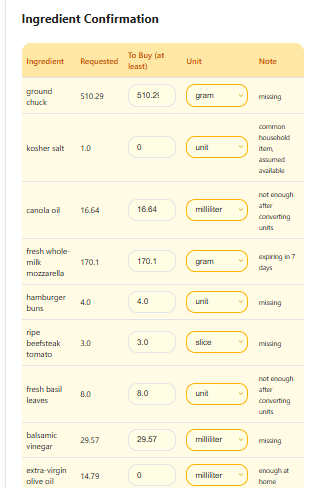

## Input Prompt
(positive food request but there is no possible solution with the given budget or even close to it)

"I want to make burger for 3 people with delivery under 50 nis"

## Ingredient Confirmation
(confirmed all as in the image below)

## Output Response

