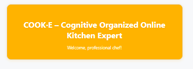
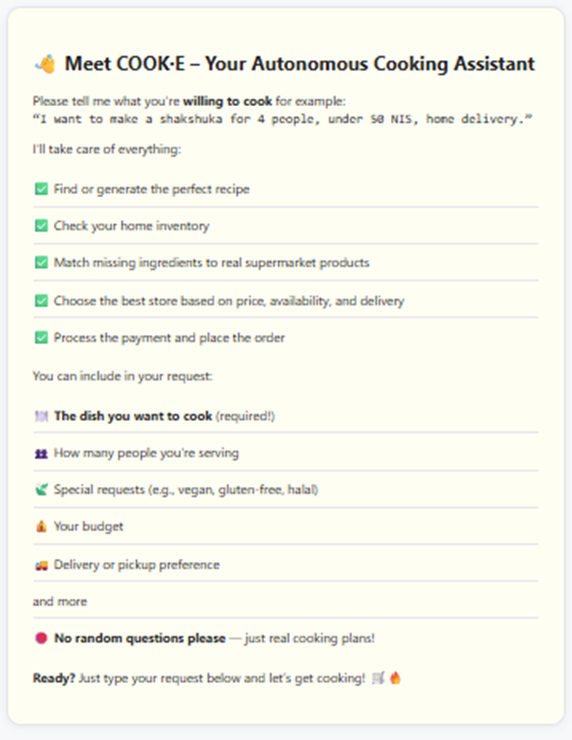
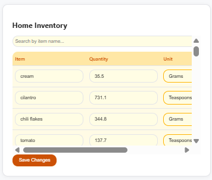
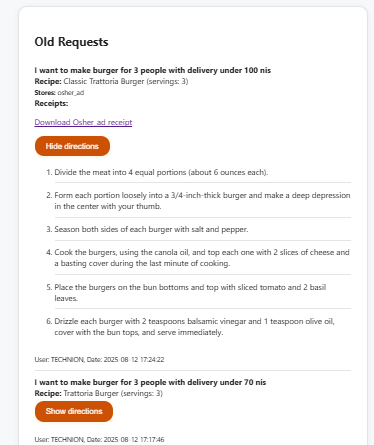

### In the web application, the user sees this explanation of the COOK·E functionality at the beginning:
COOK·E – Cognitive Organized Online Kitchen Expert
Welcome, professional chef!
👋 Meet COOK·E – Your Autonomous Cooking Assistant
Please tell me what you're willing to cook for example:
“I want to make a shakshuka for 4 people, under 50 NIS, home delivery.”

I'll take care of everything:

✅ Find or generate the perfect recipe
✅ Check your home inventory
✅ Match missing ingredients to real supermarket products
✅ Choose the best store based on price, availability, and delivery
✅ Process the payment and place the order
You can include in your request:

🍽️ The dish you want to cook (required!)
👥 How many people you're serving
🍃 Special requests (e.g., vegan, gluten-free, halal)
💰 Your budget
🚚 Delivery or pickup preference
and more
🛑 No random questions please — just real cooking plans!
Ready? Just type your request below and let’s get cooking! 🛒🔥

  

  

### Manage Home Inventory
The user can manage his home inventory in the web interface.
He can add, edit, or remove items from his inventory.

  

### View Old Requests
The user can view his old requests in the web interface.
He can see the recipes, receipts, and directions for his old requests.

  

